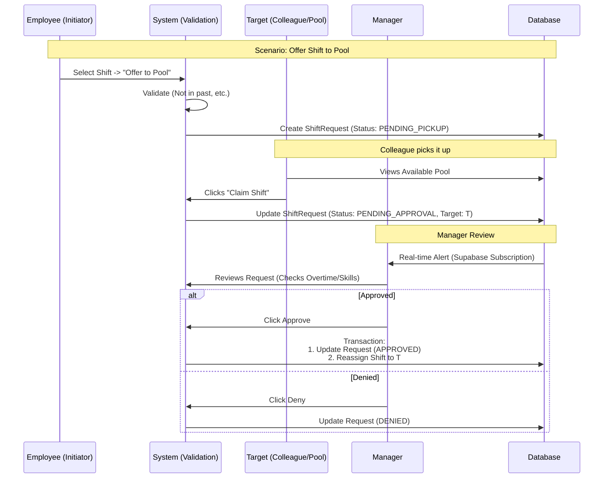

This is a significant addition to the `Scheduling` domain. To ensure this is robust and scalable, we will apply **Domain-Driven Design (DDD)** principles, specifically focusing on the **Shift Exchange Aggregate** within the **Scheduling Bounded Context**.

Below is the comprehensive User Experience Flow and Technical Design.

---

## 1. 🗺️ User Experience (UX) Flow

We need two distinct workflows: **Employee Initiation** and **Manager Adjudication**.

### 1.1 The Flows

1. **Offer/Drop (The "Give Away"):** An employee cannot work and offers the shift to the "Shift Pool" (anyone eligible) or a specific colleague.
2. **Trade (The "Swap"):** An employee proposes a direct trade ("I'll take your Tuesday if you take my Friday").
3. **Manager Review:** A gatekeeper step to prevent overtime violations or skill mismatches.

### 1.2 UX Diagram



---

## 2. 🏛️ Domain-Driven Design (DDD) Analysis

### Bounded Context: `Scheduling`

We are introducing a new Aggregate Root: **`ShiftChangeRequest`**.

### Entities & Value Objects

1. **`ShiftChangeRequest` (Aggregate Root)**
* **Identity**: `request_id` (UUID)
* **State**: `PendingPickup`, `PendingApproval`, `Approved`, `Denied`, `Cancelled`.
* **Type**: `Offer` (Give away), `Trade` (Swap).
* **Invariants**:
* A request cannot exist for a shift that has already started.
* A finalized trade must not result in double-booking the target employee.


2. **`PartialTimeWindow` (Value Object)**
* Handles the "Partial shift trades" requirement.
* Attributes: `startTime`, `endTime`.
* Logic: Ensures the partial time is strictly within the original shift boundaries.


3. **`TradeImpact` (Value Object - Calculated)**
* Attributes: `hoursDelta`, `isOvertimeRisk`, `skillMatch`.
* Used by the Manager to make informed decisions.


---

## 3. 🏗️ Technical Architecture

### 3.1 Database Schema (Supabase / PostgreSQL)

We need a dedicated table for requests. This separates "potential" changes from "actual" shifts.

```sql
-- Enums for strong typing
CREATE TYPE request_type AS ENUM ('offer', 'trade');
CREATE TYPE request_status AS ENUM ('pending_pickup', 'pending_approval', 'approved', 'denied', 'cancelled');

CREATE TABLE shift_change_requests (
  id UUID PRIMARY KEY DEFAULT gen_random_uuid(),
  restaurant_id UUID NOT NULL REFERENCES restaurants(id),
  requester_id UUID NOT NULL REFERENCES employees(id),
  
  -- The shift being offered/traded
  offered_shift_id UUID NOT NULL REFERENCES shifts(id),
  
  -- For partial trades (optional)
  offered_start_time TIMESTAMPTZ,
  offered_end_time TIMESTAMPTZ,
  
  -- The target (nullable: if NULL, it's in the "Pool")
  target_employee_id UUID REFERENCES employees(id),
  
  -- For swaps: the shift the requester wants in return (nullable)
  wanted_shift_id UUID REFERENCES shifts(id),
  
  status request_status DEFAULT 'pending_pickup',
  type request_type NOT NULL,
  
  manager_notes TEXT,
  created_at TIMESTAMPTZ DEFAULT NOW(),
  updated_at TIMESTAMPTZ DEFAULT NOW()
);

-- Index for fast "Pool" lookups
CREATE INDEX idx_pool_requests ON shift_change_requests(restaurant_id, status) 
WHERE status = 'pending_pickup';

```

### 3.2 Security & RLS (Row Level Security)

* **Select (Read):**
* **Managers:** View all rows for their `restaurant_id`.
* **Employees:** View rows where `requester_id` is them OR `target_employee_id` is them OR (`target_employee_id` is NULL AND status is `pending_pickup`).


* **Insert/Update:**
* **Employees:** Can create requests for their own shifts. Can update status to `cancelled`. Can update `target_employee_id` (claiming a pool shift).
* **Managers:** Can update status to `approved` or `denied`.


### 3.3 State Management (React Query)

We will use custom hooks to encapsulate this logic, adhering to the project's **NO Manual Caching** rule.

**`src/hooks/useShiftPool.ts`**

```typescript
export const useShiftPool = (restaurantId: string) => {
  return useQuery({
    queryKey: ['shift-pool', restaurantId],
    queryFn: async () => {
      const { data, error } = await supabase
        .from('shift_change_requests')
        .select(`
          *,
          requester:employees!requester_id(id, name, position),
          shift:shifts!offered_shift_id(*)
        `)
        .eq('restaurant_id', restaurantId)
        .in('status', ['pending_pickup', 'pending_approval']);
      
      if (error) throw error;
      return data;
    },
    // Real-time critical: Short stale time
    staleTime: 1000 * 30, 
  });
};

```

---

## 4. 💻 Implementation Strategy

### Step 1: Database Logic (The "Transaction")

Handling a trade approval is complex. It involves updating the request AND moving the shift ownership. This must be atomic. We will use a **PostgreSQL Function (RPC)**.

**`supabase/migrations/20260105_approve_trade.sql`**

```sql
CREATE OR REPLACE FUNCTION approve_shift_change(
  request_id UUID,
  manager_id UUID
) RETURNS VOID AS $$
DECLARE
  req RECORD;
BEGIN
  -- 1. Lock and Get Request
  SELECT * INTO req FROM shift_change_requests WHERE id = request_id FOR UPDATE;
  
  IF req.status != 'pending_approval' THEN
    RAISE EXCEPTION 'Request is not pending approval';
  END IF;

  -- 2. Update Request Status
  UPDATE shift_change_requests 
  SET status = 'approved', updated_at = NOW() 
  WHERE id = request_id;

  -- 3. Execute the Swap/Offer Logic
  -- (Simple case: Reassign the offered shift to the target)
  UPDATE shifts
  SET employee_id = req.target_employee_id,
      updated_at = NOW()
  WHERE id = req.offered_shift_id;

  -- (If this was a Swap, reassign the wanted shift to the requester)
  IF req.wanted_shift_id IS NOT NULL THEN
    UPDATE shifts
    SET employee_id = req.requester_id,
        updated_at = NOW()
    WHERE id = req.wanted_shift_id;
  END IF;
  
  -- 4. Handle Partial Shifts (If start/end times differ from original)
  -- Logic would go here to split the shift if necessary
END;
$$ LANGUAGE plpgsql SECURITY DEFINER;

```

### Step 2: UI Components (shadcn/ui)

We need three primary components:

1. **`TradeRequestDialog`**:
* Input: `Shift` object.
* Actions: Select "Offer to Pool" or "Select Co-worker".
* Partial: Two TimePickers initialized to Shift start/end.


2. **`ShiftPoolCard`**:
* Displays: "Server Shift: Fri 12th, 5pm-10pm".
* Context: Shows who is offering.
* Action: "Claim" (if open pool) or "Accept Trade" (if targeted).


3. **`ManagerApprovalQueue`**:
* Displays: List of `pending_approval` requests.
* Insight: Show "Weekly Hours" for the target employee to visualize Overtime risk.


### Step 3: Real-time Updates

Use the existing Supabase subscription pattern in the instructions to listen for changes to `shift_change_requests`.

```typescript
// Inside useShiftPool hook
useEffect(() => {
  const channel = supabase
    .channel(`pool-${restaurantId}`)
    .on('postgres_changes', {
      event: '*',
      schema: 'public',
      table: 'shift_change_requests',
      filter: `restaurant_id=eq.${restaurantId}`
    }, () => {
      queryClient.invalidateQueries(['shift-pool', restaurantId]);
    })
    .subscribe();
    
  return () => supabase.removeChannel(channel);
}, [restaurantId]);

```

---

## 5. 🧪 Testing Strategy (Mandatory)

Per the "Critical Rules," all new logic requires tests.

### 5.1 Unit Tests (Vitest)

* **`useShiftPool.test.tsx`**: Mock Supabase response. Verify data transforms correctly.
* **`TradeRequestDialog.test.tsx`**: Ensure partial time selectors cannot exceed shift boundaries.

### 5.2 Database Tests (pgTAP)

**`supabase/tests/shift_trade_logic.sql`**

```sql
BEGIN;
SELECT plan(3);

-- Setup: Create shifts and employees
-- ... (insert test data)

-- Test 1: Function moves shift ownership
SELECT lives_ok(
  $$SELECT approve_shift_change('req-uuid', 'manager-uuid')$$,
  'Manager approval should execute without error'
);

-- Test 2: Verify owner changed
SELECT is(
  (SELECT employee_id FROM shifts WHERE id = 'shift-uuid'),
  'target-uuid',
  'Shift ownership should transfer to target'
);

SELECT * FROM finish();
ROLLBACK;

```

---

## 🚀 Next Step

Would you like me to generate the **SQL migration file** for the `shift_change_requests` table and the `approve_shift_change` RPC function, or would you prefer to start with the **React frontend components**?